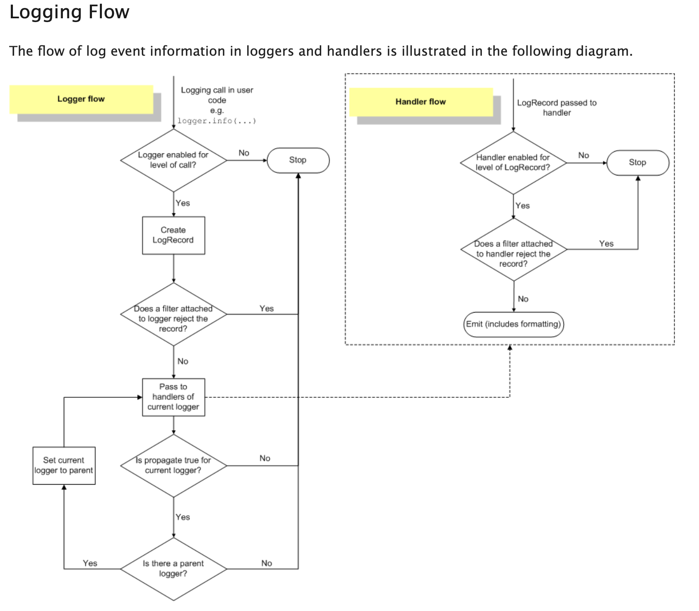

- `logging.getLogger(name)` returns an instance of the named logger. If it already exists, return the existing instance. It no name is provided, returns the root logger.
- Each logger have:
    - **Level** (severity)
    - Zero or more **Handlers**
    - **Formatter**
    - **Filter**
- The loggers have hierarchy with root being the top level logger.
- If configuration is not set for a logger, it keeps going up the hierarchy to its parents until it finds it. If nothing is found, use the root logger config since it is the parent of all loggers.
- We can configure loggers:
    - Directly in python scripts
    - Using config file and import it using `logging.config.fileConfig(file_name)`
    - OR using dictionary in YAML file and import it using `logging.config.dictConfig()`
- To share the same configuration of loggers across different modules, we only configure root logger in the entry module and all other loggers will use the root config since root is their parent.
