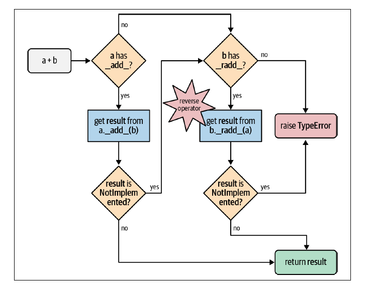

Operator overloading is when a given operator behave differently according to the type
of the operand(s). For example, the `+` operator can add two number,
concatenate strings, and merge two lists. This mean `int`, `str`, and `list`
classes have their own implementation of the `+` operator. 

Python has limited operator overloading with some limitations where we can't create new operators and prevent overloading for:

- operators of the built-in types
- `is`, `and`, `or`, `not`

If an operator doesn't know how to handle the type of an operand, it returns
`NotImplemented` so the interpreter tries to check the right-side operand if
it knows how to handle it. Below is the flowchart of computing `a + b` with
`__add__` and `__radd__`
([Source](https://www.amazon.com/Fluent-Python-Concise-Effective-Programming/dp/1492056359/ref=sr_1_1?keywords=fluent+python&qid=1671406555&sr=8-1)):

